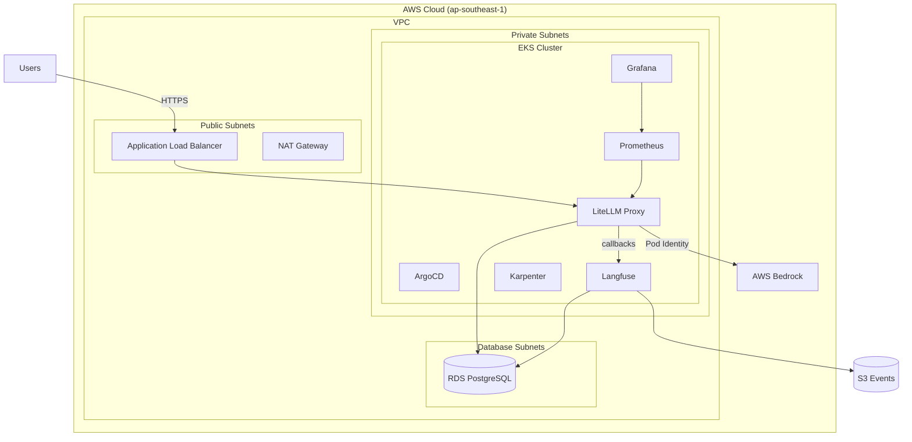

# LiteLLM on AWS EKS — Production Gateway with Observability & Guardrails

Production-grade LiteLLM proxy deployment on Amazon EKS with full observability stack, AI guardrails, and automated team onboarding.

## Architecture



## Features

- **LLM Gateway**: LiteLLM proxy with Bedrock model routing (Nova Lite 2 configured; additional models extensible via DB)
- **Guardrails**: Built-in `litellm_content_filter` with Singapore-specific PII patterns (NRIC, phone, postal code, UEN, bank account), AWS/GitHub credential detection, and harmful content categories
- **Observability**: Prometheus metrics, Grafana dashboards, Langfuse LLM tracing (traces, cost, latency per request)
- **Auto-scaling**: Karpenter for nodes (on-demand, dedicated NodePools per workload), HPA for LiteLLM pods
- **Team Management**: Automated onboarding via LiteLLM Admin API with budget controls and virtual keys

## Prerequisites

- AWS Account with Bedrock model access enabled in ap-southeast-1
- Terraform >= 1.5
- AWS CLI configured
- kubectl
- Helm 3

## Quick Start

```bash
# Clone and initialize
git clone <repo-url> && cd litellm

# Set required secrets
export TF_VAR_litellm_master_key="sk-your-master-key"

# Deploy infrastructure
make init
make plan
make apply

# Configure kubectl
make kubeconfig

# Verify
make status
```

## Directory Structure

```
litellm/
├── live/                    # Terraform (flat structure)
│   ├── providers.tf         # AWS provider, backend
│   ├── variables.tf         # Input variables
│   ├── versions.tf          # Provider version constraints
│   ├── data.tf              # Data sources
│   ├── locals.tf            # Local values (DB creds, etc.)
│   ├── vpc.tf               # VPC, 3-tier subnets
│   ├── eks.tf               # EKS cluster + node groups
│   ├── blueprints.tf        # EKS Blueprints add-ons + Karpenter NodePools
│   ├── irsa.tf              # IAM roles for service accounts
│   ├── rds.tf               # RDS PostgreSQL (Free Tier)
│   ├── langfuse.tf          # Langfuse Helm + S3 bucket
│   └── litellm.tf           # LiteLLM Helm + Gateway API
├── k8s/                     # Kubernetes manifests
│   ├── litellm/             # LiteLLM config + guardrails
│   ├── langfuse/            # Langfuse Helm values
│   ├── monitoring/          # ServiceMonitor + Grafana dashboard
│   └── argocd-values.yaml   # ArgoCD Helm values
├── docs/                    # Article drafts
```

## Guardrails

The LiteLLM proxy uses the built-in `litellm_content_filter` guardrail with pre-call pattern matching and content category filtering:

| Pattern | Type |
|---------|------|
| Singapore NRIC | `sg_nric` (e.g. `S1234567A`) |
| Singapore Phone | `sg_phone` |
| Singapore Postal Code | `sg_postal_code` |
| Singapore Passport | `passport_singapore` |
| Singapore UEN | `sg_uen` |
| Singapore Bank Account | `sg_bank_account` |
| Email Address | `email` |
| AWS Access Key | `aws_access_key` (`AKIA...`) |
| AWS Secret Key | `aws_secret_key` |
| GitHub Token | `github_token` |
| Harmful content | `self_harm`, `violence`, `illegal_weapons` |

## Team Onboarding

Teams and virtual keys are managed via LiteLLM's Admin API. Keys are stored in AWS Secrets Manager at `litellm/<team-name>/key-N`.

## Monitoring

- **Grafana**: Request rate, latency (p95), token usage, spend per team, error rates, guardrail rejections
- **Langfuse**: Full LLM traces — prompts, completions, cost, latency, session grouping
- **Alerts**: High error rate, latency spikes (via PrometheusRule)

## Screenshots

| Grafana Dashboard | Langfuse Traces |
|---|---|
|  |  |

| LiteLLM Usage | LiteLLM Logs | LiteLLM Playground |
|---|---|---|
|  |  |  |

## Cost Considerations

This is an educational/single-environment setup optimized for cost:
- Single NAT Gateway
- Single RDS PostgreSQL instance (db.t3.micro, Free Tier eligible — ~$0 for first 12 months, ~$15/mo after)
- Karpenter uses on-demand instances with dedicated NodePools per workload

## License

MIT
