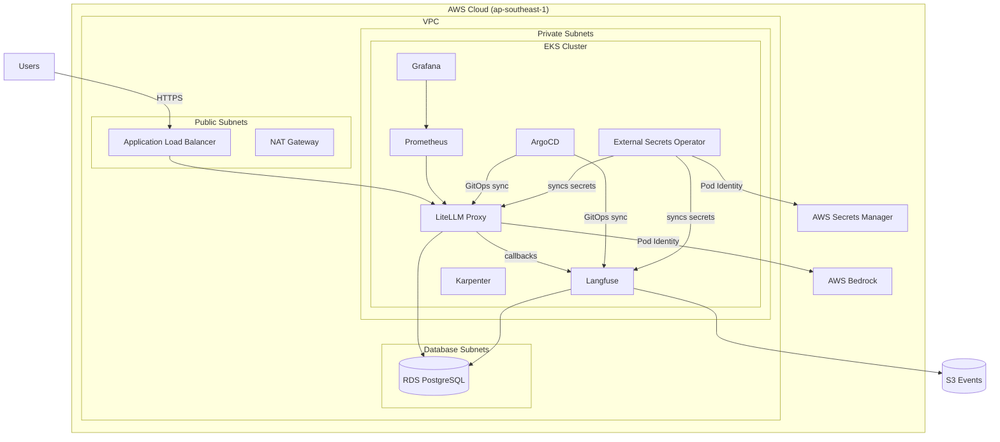
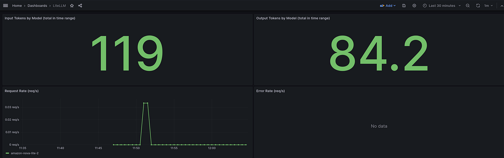
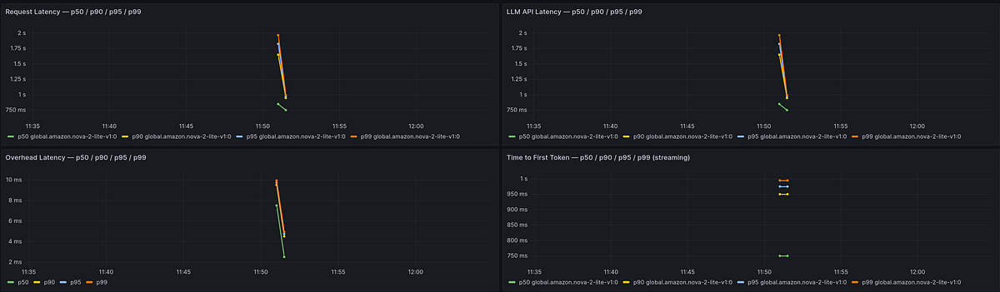
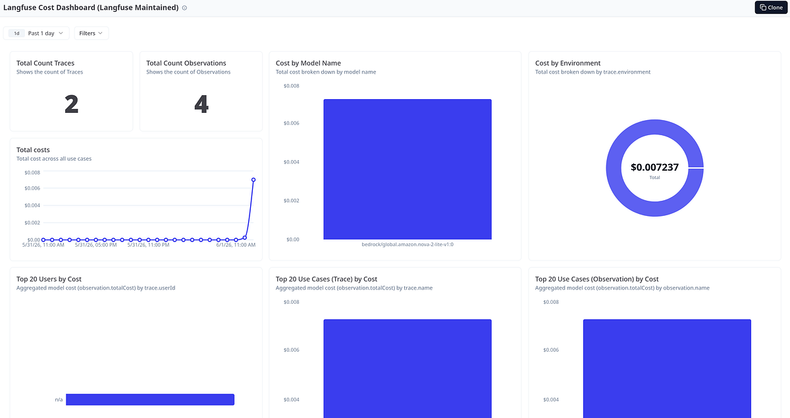
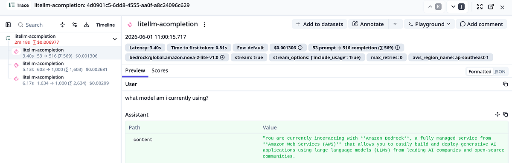

# LiteLLM on AWS EKS — Production Gateway with Observability & Guardrails

Production-grade LiteLLM proxy deployment on Amazon EKS with GitOps delivery (ArgoCD), External Secrets Operator, full observability stack, AI guardrails, and Karpenter autoscaling.

## Architecture



## Features

- **GitOps Delivery**: ArgoCD multi-source `Application` resources provisioned by Terraform — chart version, environment values, and raw manifests in separate sources
- **Secret Management**: External Secrets Operator pulls credentials from AWS Secrets Manager at runtime; no secrets in git or Helm values
- **LLM Gateway**: LiteLLM proxy with Bedrock model routing (Nova Lite 2 configured; additional models extensible via DB)
- **Guardrails**: Built-in `litellm_content_filter` with Singapore-specific PII patterns (NRIC, phone, postal code, UEN, bank account), AWS/GitHub credential detection, and harmful content categories
- **Observability**: Prometheus metrics, Grafana dashboards, Langfuse LLM tracing (traces, cost, latency per request)
- **Auto-scaling**: Karpenter for nodes (on-demand, dedicated NodePools per workload), HPA for LiteLLM pods
- **Zero Static Credentials**: All pods use EKS Pod Identity associations — no access keys, no rotation schedules

## Prerequisites

- AWS Account with Bedrock model access enabled in `ap-southeast-1`
- Terraform >= 1.5
- AWS CLI configured
- `kubectl`
- `helm`

### Required Secrets Manager Secrets

Before deploying, create the following two secrets in AWS Secrets Manager (`ap-southeast-1`):

**`litellm-eks/litellm-secrets`:**
```json
{
  "LITELLM_MASTER_KEY": "",
  "LANGFUSE_PUBLIC_KEY": "",
  "LANGFUSE_SECRET_KEY": ""
}
```

**`litellm-eks/langfuse-secrets`:**
```json
{
  "NEXTAUTH_SECRET": "",
  "SALT": "",
  "LANGFUSE_PUBLIC_KEY": "",
  "LANGFUSE_SECRET_KEY": "",
  "CLICKHOUSE_PASSWORD": "",
  "REDIS_PASSWORD": "",
  "INIT_USER_EMAIL": "",
  "INIT_USER_PASSWORD": ""
}
```

> The RDS master user password is auto-managed by AWS — no manual secret creation required for DB credentials.

## Quick Start

```bash
# Clone
git clone https://github.com/mdnfr0211/llm-gateway && cd llm-gateway

# Create the Secrets Manager secrets above, then:

# Deploy infrastructure
make init
make plan
make apply

# Configure kubectl
make kubeconfig

# Verify
make status
```

## Directory Structure

```
llm-gateway/
├── live/                    # Terraform (flat structure, all resources in *.tf files)
│   ├── providers.tf         # AWS provider, backend config
│   ├── versions.tf          # Provider version constraints
│   ├── variables.tf         # Input variables
│   ├── terraform.tfvars     # Variable values (cluster name, region, instance types)
│   ├── locals.tf            # Local values (DB names, git repo ref)
│   ├── data.tf              # Data sources
│   ├── vpc.tf               # 3-tier VPC across 3 AZs
│   ├── eks.tf               # EKS cluster + managed node group
│   ├── blueprints.tf        # EKS Blueprints addons (ArgoCD, Karpenter, ALB Controller, ESO, Prometheus stack)
│   ├── karpenter.tf         # Karpenter NodePool/EC2NodeClass pairs (default, litellm, langfuse)
│   ├── alb.tf               # Gateway API CRDs (v1.5.0) + amazon-alb GatewayClass
│   ├── irsa.tf              # Pod Identity roles (litellm-bedrock, langfuse-s3, eso)
│   ├── rds.tf               # RDS PostgreSQL (db.t3.micro, managed master password)
│   ├── argocd.tf            # ArgoCD Application resources (eso-resources, langfuse, litellm)
│   ├── langfuse.tf          # Langfuse ExternalSecret + S3 events bucket
│   └── litellm.tf           # LiteLLM ExternalSecret
├── k8s/                     # Kubernetes manifests and Helm values
│   ├── litellm/
│   │   ├── values.yaml      # LiteLLM Helm values (nodeSelector, HPA, guardrails config)
│   │   └── manifests/       # Gateway API resources (TargetGroupConfig, LBConfig, Gateway, HTTPRoute)
│   ├── langfuse/
│   │   └── values.yaml      # Langfuse Helm values (Redis, ClickHouse, external RDS + S3)
│   ├── eso/
│   │   └── cluster-secret-store.yaml  # ClusterSecretStore pointing to AWS Secrets Manager
│   ├── monitoring/          # ServiceMonitor + Grafana dashboard ConfigMap
│   └── argocd-values.yaml   # ArgoCD Helm values
├── docs/                    # Article and images
```

## Guardrails

The LiteLLM proxy uses the built-in `litellm_content_filter` guardrail with pre-call pattern matching and content category filtering:

| Pattern | Type |
|---------|------|
| Singapore NRIC | `sg_nric` (e.g. `S1234567A`) |
| Singapore Phone | `sg_phone` |
| Singapore Postal Code | `sg_postal_code` |
| Singapore Passport | `passport_singapore` |
| Singapore UEN | `sg_uen` |
| Singapore Bank Account | `sg_bank_account` |
| Email Address | `email` |
| AWS Access Key | `aws_access_key` (`AKIA...`) |
| AWS Secret Key | `aws_secret_key` |
| GitHub Token | `github_token` |
| Harmful content | `self_harm`, `violence`, `illegal_weapons` |

## Monitoring

- **Grafana**: Request rate, latency (p95), token usage, spend per team, error rates, guardrail rejections
- **Langfuse**: Full LLM traces — prompts, completions, cost, latency, session grouping
- **Alerts**: High error rate, latency spikes (via PrometheusRule)

## Useful Commands

```bash
make kubeconfig          # Update kubeconfig for the EKS cluster
make status              # Show nodes and LiteLLM pod status

make port-forward-litellm    # localhost:4000
make port-forward-grafana    # localhost:3000
make port-forward-argocd     # localhost:8080

make health              # LiteLLM health check (requires port-forward)
make models              # List configured models
make teams               # List teams (requires LITELLM_MASTER_KEY env var)
```

## Screenshots

**Grafana Dashboard**





**Langfuse Traces**





**LiteLLM**


## Cost

Estimated ~$300/mo for a single-environment setup:

| Resource | Monthly Estimate |
|----------|-----------------|
| EKS Cluster | ~$73 |
| NAT Gateway | ~$32 |
| c7i-flex.large managed nodes (2×) | ~$104 |
| c7i-flex.large Karpenter nodes (LiteLLM + Langfuse pools) | ~$104 |
| RDS db.t3.micro | ~$0 (Free Tier, first 12 months) / ~$15 after |

> `c7i-flex` instances are selected for broad availability. Production teams should choose instance families appropriate to their workload requirements.

## License

MIT
