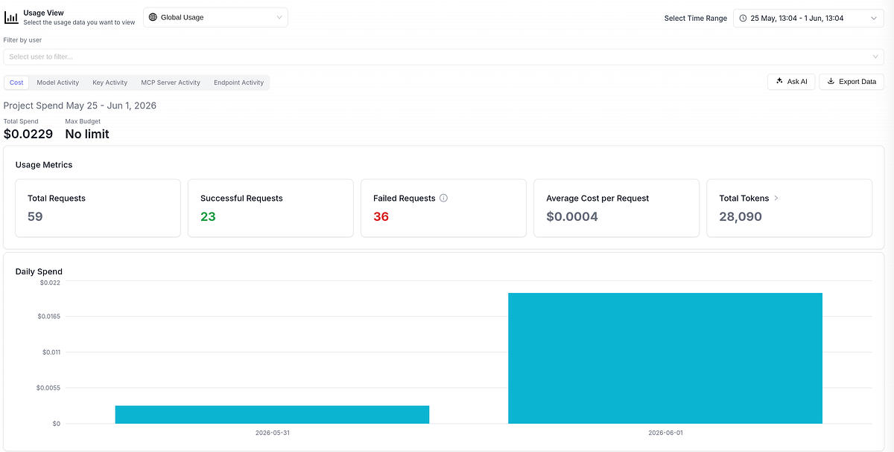
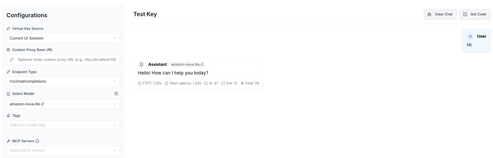

# Production-Grade LiteLLM Gateway on AWS EKS with Observability & Guardrails

## Introduction

As organizations scale their AI adoption, managing LLM access becomes a critical infrastructure challenge. Teams need centralized routing, cost controls, usage visibility, and safety guardrails — especially in regulated industries operating under data residency requirements.

In this article, I'll walk through deploying **LiteLLM** as a production-grade LLM gateway on **Amazon EKS**, complete with:

- Multi-model routing via AWS Bedrock
- AI guardrails for PII and credential detection
- Full observability (Prometheus, Grafana, Langfuse)
- Infrastructure as Code with Terraform

## Architecture Overview

The architecture follows AWS best practices with a 3-tier VPC, EKS for orchestration, and managed services for persistence:

```
Users → ALB (Gateway API) → LiteLLM Proxy → AWS Bedrock (Nova Lite 2)
                                  ↓
                        RDS PostgreSQL (teams, keys, spend tracking)
                                  ↓
                        Langfuse (LLM tracing, cost attribution) → S3 (events)
                                  ↓
                        Prometheus → Grafana (metrics dashboards)
```

### Key Design Decisions

1. **Flat Terraform structure** — All infrastructure in `live/*.tf` files. No nested modules for simplicity and readability.
2. **Public modules only** — Using well-maintained community modules from the Terraform Registry.
3. **EKS Blueprints** — Leveraging `aws-ia/eks-blueprints-addons` for consistent add-on management.
4. **Gateway API** — Modern Kubernetes ingress using Gateway API instead of legacy Ingress resources. The AWS Load Balancer Controller v3.3.0 handles the `amazon-alb` GatewayClass.
5. **EKS Pod Identity** — No static credentials; pods assume IAM roles via native EKS Pod Identity associations.

## Step 1: VPC & Networking

We create a 3-tier VPC across 3 availability zones using the `terraform-aws-modules/vpc/aws` module:

- **Public subnets** — ALB, NAT Gateway
- **Private subnets** — EKS nodes, pods
- **Database subnets** — RDS PostgreSQL (no internet access)

Subnets are tagged for EKS auto-discovery and Karpenter node provisioning.

## Step 2: EKS Cluster

The EKS cluster runs Kubernetes 1.31 with managed add-ons:

| Add-on | Purpose |
|--------|---------|
| `vpc-cni` | Pod networking |
| `kube-proxy` | Service routing |
| `coredns` | Cluster DNS |
| `eks-pod-identity-agent` | Enables Pod Identity for credential-free IAM |
| `aws-ebs-csi-driver` | Persistent volume support (used by Langfuse, Prometheus) |

A default managed node group (`t3.medium`) provides initial capacity for system workloads, while Karpenter handles dynamic scaling for application workloads.

## Step 3: Platform Add-ons via EKS Blueprints

Using `aws-ia/eks-blueprints-addons`, we deploy the full platform stack in a single Terraform module:

| Component | Role |
|-----------|------|
| **ArgoCD** | GitOps for application delivery |
| **Karpenter** | Just-in-time node provisioning (on-demand only) |
| **AWS Load Balancer Controller** | Gateway API integration (`ALBGatewayAPI` feature gate enabled) |
| **kube-prometheus-stack** | Prometheus + Grafana with `serviceMonitorSelectorNilUsesHelmValues: false` so any namespace can be scraped |

We also apply:
- **Gateway API CRDs** (v1.1.0) — GatewayClass, Gateway, HTTPRoute, GRPCRoute
- **`amazon-alb` GatewayClass** — wires the ALB controller to Gateway API
- **`gp3` StorageClass** — set as default, `WaitForFirstConsumer`, encrypted EBS volumes

### Karpenter NodePools

Three NodePool/EC2NodeClass pairs are provisioned, all on on-demand `c7i-flex.large` / `m7i-flex.large` (AL2023 AMI):

| NodePool | Taint | Purpose |
|----------|-------|---------|
| `default` | none | System and add-on workloads |
| `litellm` | `workload=litellm:NoSchedule` | LiteLLM pods only |
| `langfuse` | `workload=langfuse:NoSchedule` | Langfuse pods only |

The dedicated NodePools with `NoSchedule` taints ensure LiteLLM and Langfuse pods land on isolated nodes, preventing noisy-neighbour effects. All pools use `consolidationPolicy: WhenUnderutilized` with limits of 100 CPU / 200Gi.

## Step 4: LiteLLM Deployment

LiteLLM is deployed via Helm (chart `litellm-helm` v1.86.2 from OCI registry) with:

- **Model routing** — `amazon-nova-lite-2` (`bedrock/global.amazon.nova-2-lite-v1:0`) is the seeded model. With `store_model_in_db: true`, additional models can be added at runtime via the Admin API without redeploying.
- **Database backend** — RDS PostgreSQL stores teams, virtual keys, and spend tracking
- **Pod Identity** — The LiteLLM service account assumes an IAM role with scoped Bedrock permissions (see below)
- **Callbacks** — `prometheus` and `langfuse` are enabled inline in `config.yaml`

### LiteLLM IAM Permissions (EKS Pod Identity)

The LiteLLM pod assumes `<cluster>-litellm-bedrock` via EKS Pod Identity (no static keys). The policy grants:

```json
{
  "Effect": "Allow",
  "Action": [
    "bedrock:InvokeModel",
    "bedrock:InvokeModelWithResponseStream",
    "bedrock:InvokeFoundationModel"
  ],
  "Resource": [
    "arn:aws:bedrock:::foundation-model/amazon.nova-2-lite-v1:0",
    "arn:aws:bedrock:ap-southeast-1::foundation-model/amazon.nova-2-lite-v1:0",
    "arn:aws:bedrock:ap-southeast-1:<account>:inference-profile/global.amazon.nova-2-lite-v1:0"
  ]
}
```

The resource list covers both the regional foundation model ARN and the global cross-region inference profile, which is what the `bedrock/global.*` model string resolves to at runtime.

### Guardrails Configuration

LiteLLM's built-in `litellm_content_filter` guardrail runs pre-call with zero external dependencies and sub-millisecond overhead. Our configuration covers two concern areas:

**Harmful content categories** (BLOCK at medium severity):

| Category | Action |
|----------|--------|
| `harmful_self_harm` | BLOCK |
| `harmful_violence` | BLOCK |
| `harmful_illegal_weapons` | BLOCK |

**PII and credential patterns** (prebuilt pattern matching):

| Pattern | Action |
|---------|--------|
| `sg_nric` | BLOCK |
| `passport_singapore` | BLOCK |
| `sg_bank_account` | BLOCK |
| `aws_access_key` | BLOCK |
| `aws_secret_key` | BLOCK |
| `github_token` | BLOCK |
| `sg_phone` | MASK |
| `sg_postal_code` | MASK |
| `sg_uen` | MASK |
| `email` | MASK |

Singapore-specific patterns reflect the ap-southeast-1 deployment region and relevant data residency considerations. BLOCK rejects the request; MASK redacts the value before forwarding to Bedrock.

If you need NLP-powered detection for unstructured PII (names, addresses) that regex misses, LiteLLM also supports **Microsoft Presidio** (self-hosted sidecar, ~50-200ms added latency) and **AWS Bedrock Guardrails** (managed service, ~300-500ms). The built-in filter is the right starting point for structured patterns.

## Step 5: Observability

### Metrics (Prometheus + Grafana)

LiteLLM exposes a `/metrics` endpoint with:
- Request rate and latency histograms
- Token usage by model
- Spend tracking by team
- Guardrail rejection counts

A custom Grafana dashboard provides at-a-glance visibility into proxy health and usage patterns.


### LLM Tracing (Langfuse)

We use **Langfuse** — a purpose-built LLM observability platform — self-hosted on the same EKS cluster. LiteLLM has native Langfuse integration via its callback system. By adding `"langfuse"` to `callbacks`, every LLM request is automatically traced with:

- **Full request/response pairs** — prompts, completions, and tool calls
- **Cost tracking** — token usage and spend per request, model, team, and API key
- **Latency breakdown** — time-to-first-token, total duration, queue time
- **Session grouping** — multi-turn conversations linked together

Langfuse is backed by the same RDS PostgreSQL instance (separate `langfuse` database) and uses S3 for large event payloads to keep the database lean. The S3 bucket has lifecycle policies (30d → Standard-IA, 90d expiry).

### Langfuse IAM Permissions (EKS Pod Identity)

The Langfuse pod assumes `<cluster>-langfuse-s3` via EKS Pod Identity. The policy is scoped to the Langfuse events bucket only:

```json
{
  "Effect": "Allow",
  "Action": ["s3:PutObject", "s3:GetObject", "s3:ListBucket", "s3:DeleteObject"],
  "Resource": [
    "arn:aws:s3:::<langfuse-events-bucket>",
    "arn:aws:s3:::<langfuse-events-bucket>/*"
  ]
}
```


### LiteLLM UI

LiteLLM ships with a built-in UI for managing usage, inspecting logs, and testing models interactively.






This gives us a clean separation of concerns:
- **Prometheus + Grafana** → operational metrics, alerting, SLO tracking
- **Langfuse** → LLM-specific deep dives, cost attribution, trace inspection
- **LiteLLM UI** → live usage, logs, and ad-hoc testing

## Cost Profile

For an educational/single-environment setup:

| Resource | Monthly Estimate |
|----------|-----------------|
| EKS Cluster | ~$73 |
| NAT Gateway | ~$32 |
| t3.medium nodes (2x, system workloads) | ~$60 |
| RDS db.t3.micro | ~$0 (Free Tier, first 12 months) / ~$15 after |
| Langfuse (on EKS) | ~$0 (runs on existing Karpenter nodes) |
| **Total** | **~$165/mo (first year) / ~$180/mo after** |

## Conclusion

This architecture provides a solid foundation for organizations looking to centralize LLM access with enterprise controls. The combination of LiteLLM's routing capabilities, EKS's scalability, and AWS managed services creates a platform that scales from POC to production.

Key takeaways:
- **Guardrails are essential** — Blocking credentials and Singapore-specific PII at the proxy layer before they reach the LLM
- **Observability from day one** — Teams need visibility into cost and usage before scaling
- **Workload isolation** — Dedicated Karpenter NodePools with taints prevent noisy-neighbour effects between LiteLLM and Langfuse
- **Infrastructure as Code** — Reproducible, auditable, and version-controlled

---

*Full source code available on [GitHub](https://github.com/navfar/litellm-eks).*
